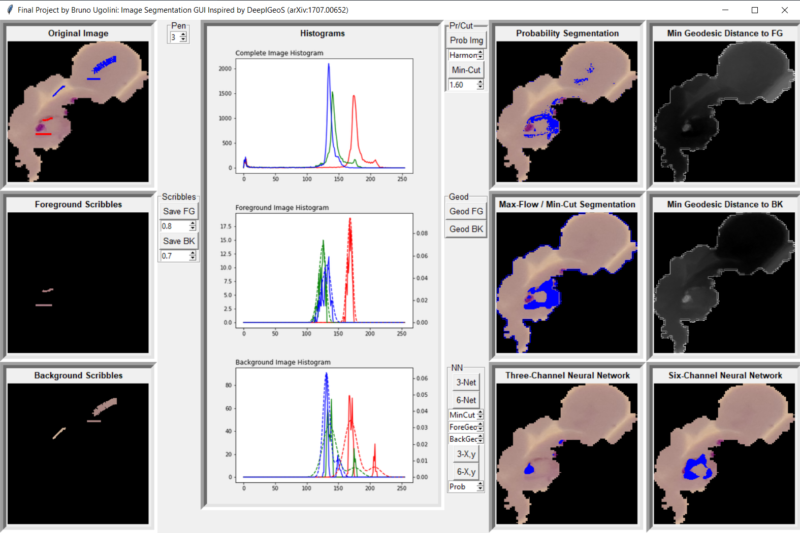
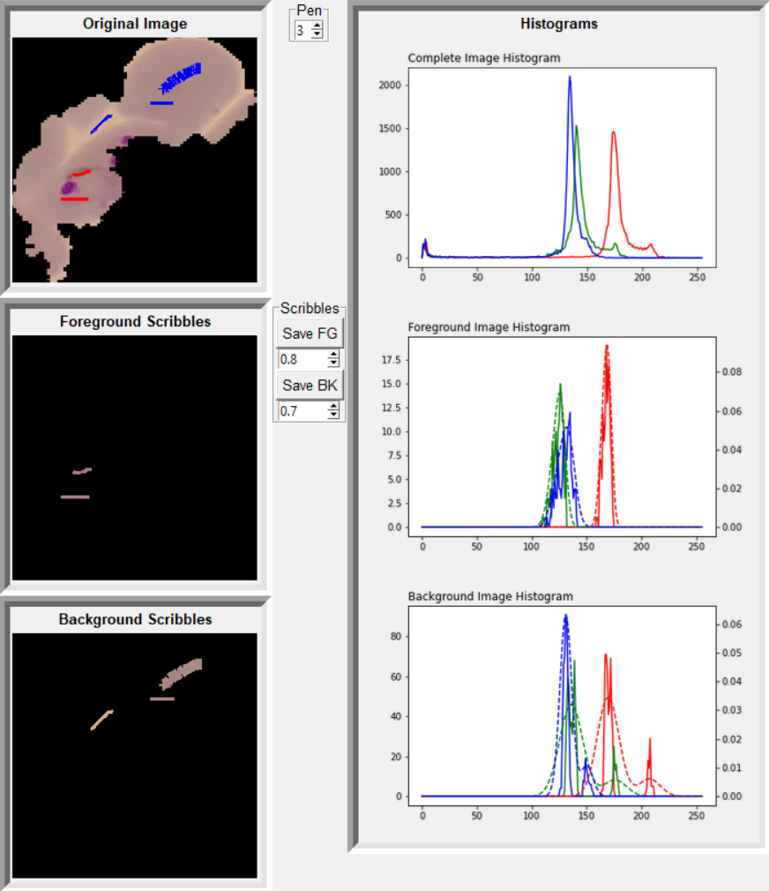
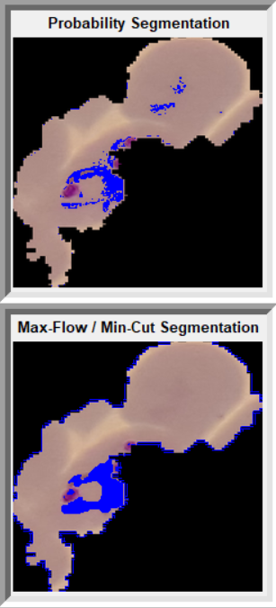
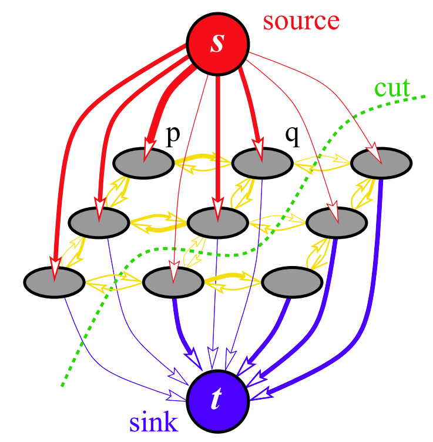
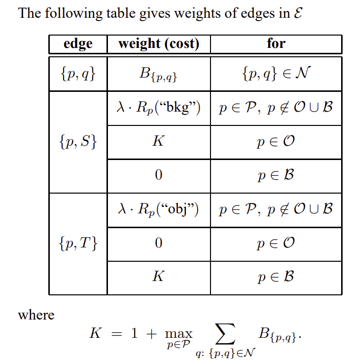
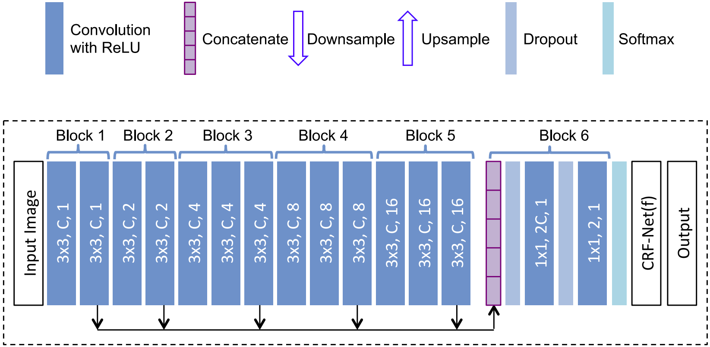
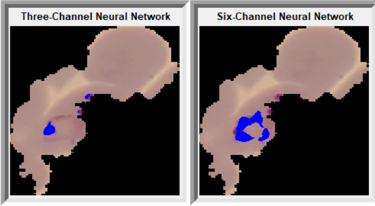
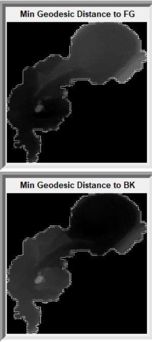
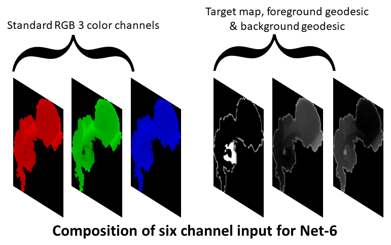

# Final Project of [Bruno Ugolini](https://www.linkedin.com/in/brunougolini/ target="_blank" rel="noopener noreferrer") for the [Data Science Diploma](https://concordiabootcamps.ca/courses/data-science-remote/)

## **Summary**
### This project was inspired by [this paper](https://arxiv.org/abs/1707.00652) wherein a methodology is developed for applying user inputs as corrections to the segmentation of medical imaging. Why go through such an arduous task when deep neural nets exist for image segmentation? Because medical images (X-rays, scans, etc.) are often grayscale with very low contrast between features. Medical practitioners need to identify features within these images to a high confidence level. Ultimately, the objective is to divide an image into foreground (FG) object and background (BG). The image dataset used was of blood cells infected with the malaria parasite.

## **Objective**
### The objective for this project was not to reproduce the reference work as such but to develop a similar scheme in order to gain insight into this field as well as a deeper knowledge of neural nets and graph theory (and to a lesser extent, GUI programming).

# Walkthrough of the Method
## **1. Probability Mapping**

### The reference paper framework assumes the existence of a trained neural net. However, since I was starting from scratch, I first developed a simple mapping of each pixel belonging to either FG or BG based on user scribbles (with adjustable pen width) of these regions. The probability of a pixel belonging to FG is based on the RGB components compared to the KDE of the foreground pixels. The histogram of the total image, FG and BG pixels are all displayed on the GUI and the bandwidth of the KDE can be adjusted by the user.

  
  

## **2. Graph Theory and Maximum-Flow / Minimum-Cut**
### In order to further refine the segmentation, [interactive graph cuts](https://www.csd.uwo.ca/~yboykov/Papers/iccv01.pdf) are used. The methodology I applied follows exactly the reference paper cited. That is, the image is represented as a graph with each pixel being a node on the graph. These pixel-nodes have attributes such as R, G, B and equivalent grayscale intensity. As well, each pixel-node could be identified as belonging to (in a strict manner) either FG or BG based on user scribbles. The edges betweeen nodes could be weighted by various means such as absolute change in intensity between neighbors, change in FG probabilty, etc.

  
  

### Two additional terminal nodes are introduced: S, the source node and T, the sink node. Imagine a flow of water initiating from the S node that flows into the nodes of the images and then drains into the sink node T on the other side of the image. The theory states that the maximum flow (based on the "capacity" of the edge weights to carry/resist the flow) is achieved when the graph cut segmenting the nodes (pixels) into reachable (FG) and unreachable (BG) is minimized. This theory is applied in my work and the results displayed interactively. The lambda factor that gives priority to either region or boundary conditions for the graph cut can be modified in the GUI by the user.

## **3. Neural Networks**
### Using the methodology described above, a small subset of images can be treated in order to create inputs (the original image) and target segmentation (FG / BG as defined by the graph cuts). These can then be used to train a neural network or two.

## **3.1 Three-Channel Neural Network (3-Net)**
### A neural network (NN) was devised by the authors of the original paper and a watered-down version was implemented here (omitting the trainable Conditional Random Field (CRF) prior to output). This NN is based on VGG-16 but was modified in several ways by the authors. First, since the objective here is image segmentation rather than image classification, the NN has to be resolution-preserving. Therefore, all max-pooling and downsampling is eliminated since this would lead to a change of resolution in the channels. In their stead, [dilated convolution](https://towardsdatascience.com/understanding-2d-dilated-convolution-operation-with-examples-in-numpy-and-tensorflow-with-d376b3972b25) is the mechanism by which the receptive field of image features is harnessed. Another difference to VGG-16 is the addition of a concatenation layer that merges the output of the five convolutional blocks.

### Apart from the omission of the CRF, the NN presented in the source paper was implemented as is and training was conducted as the collection of segmented image/target pairs were generated. The GUI presents the segmentation resulting from this 3-Net. The 3 channels refers to the RGB channels of the original image.

  

## **3.2 Six-Channel Neural Network (6-Net)**
### The authors devised a novel way to implement the user scribbles that correct the segmentation as inputs into a six-channel NN. I implemented this same NN while omitting once again the penultimate CRF. This NN is identical to that described above but with an additional three "color" channels. These three are: an initial target segmentation and two geodesic mappings of the FG and BG corrections. The former comes from the three-channel net but I opted to also allow the use of the probability mapping or min-cut mapping as well. This is justified since my 3-Net is not mature and was constantly being re-trained from scratch. The goal was to achieve a good target segmentation for each image.

  

### The geodesic mappings are generated from the corrections to the segmentation made by the user. The user makes a scribble to include a FG element tagged by 3-Net as BG. The minimum geodesic distance from any given pixel to the FG scribble is found and assigned as its "color". This produces a grayscale image where the points closest in geodesic distance to the scribble are black and those farther are paler. The geodesic distance is the distance as determined by a particular edge weight. In this case, the absolute difference in pixel intensity between neighbors. The use of geodesic distance rather than euclidian distance favors clustering of pixels with a common intensity even though they may be physically distant.

  

## **4. Implementation**
### A small set of images are processed by probability and min-cut mappings in order to define adequate target segmentations. These X and y arrays are then used to train 3-Net. A wider number of images is now processed and the 3-Net segmentation is corrected yielding the additional three channels (initial target + FG/BG geodesic maps) to be consumed in training by 6-Net. 3-Net is re-trained and 6-Net is trained for use in the GUI. Repeat.

### While this implementation was conducted, the core of the effort went into researching the methods, applying and modifying them as needed and finally, getting the code to run efficiently (sparse representation of graphs, joblib, etc.).

## **5. Epilogue**
### So much of Data Science boils down to graph theory with its applications and methods.
### Training a NN with a small dataset provides quite the random output.
### Tkinter does not port to a website (learned all too late sadly).

